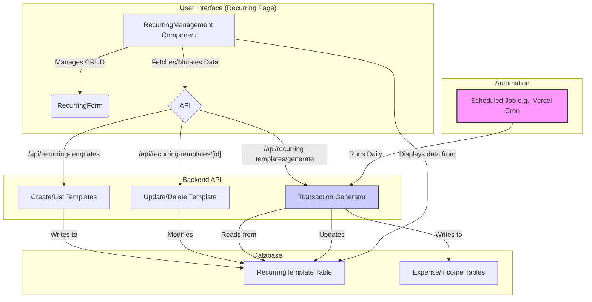

### The Recurring Feature Explained

The feature is split into two main parts: **Template Management** (what you interact with) and **Transaction Automation** (what the system does in the background).

Here is a diagram illustrating the entire flow:

Here’s a step-by-step breakdown of the process:

### 1. Template Management (The User's Role)

This is the part you interact with on the "Recurring" page. It's all about creating and managing the _rules_ for your recurring transactions.

- **Interface**: You use the `RecurringManagement` component to see all your recurring transaction templates.
- **Actions**: From here, you can **Create**, **Update**, or **Delete** templates using the `RecurringForm`.
- **Template**: A template is not an actual transaction. It's a blueprint that contains all the necessary information:
  - Type (`EXPENSE` or `INCOME`)
  - Amount and Description
  - Category (for expenses)
  - Frequency (`WEEKLY`, `MONTHLY`, `YEARLY`) and Interval (e.g., every **2** weeks)
  - Start Date, End Date (optional), and Active status.

When you create or edit a template, the application communicates with the backend API (`/api/recurring-templates`) to save your rules to the database. A key field, `nextDueDate`, is calculated and stored with the template.

### 2. Transaction Automation (The System's Role)

This is the "magic" that makes the feature recurring. It's handled automatically by the backend.

- **The Generator**: There is a special API endpoint: `GET /api/recurring-templates/generate`.
- **Scheduled Task**: This endpoint is designed to be run on a schedule, typically once a day (for example, using a Vercel Cron Job).
- **The Process**: When the scheduled task runs, it hits the generator endpoint, which does the following:
  1.  **Finds Due Templates**: It queries the database for all `active` templates whose `nextDueDate` is today or in the past and that haven't expired.
  2.  **Generates Transactions**: For each "due" template it finds, it creates a new, real transaction in your `Expense` or `Income` records. This new transaction is marked as auto-generated and linked back to its parent template.
  3.  **Updates the Due Date**: After creating the transaction, it calculates the _next_ due date based on the template's frequency (e.g., it adds 1 month for a monthly recurring transaction) and updates the template's `nextDueDate`.

This final step is crucial. By advancing the `nextDueDate`, the system ensures it won't generate another transaction for the same template until the next cycle arrives.

In summary, you set the rules, and a daily automated process takes care of creating the individual transactions for you, ensuring your recurring payments and incomes are logged consistently and on time.
